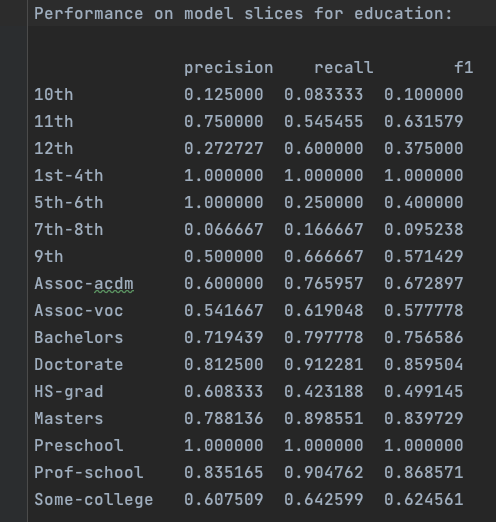
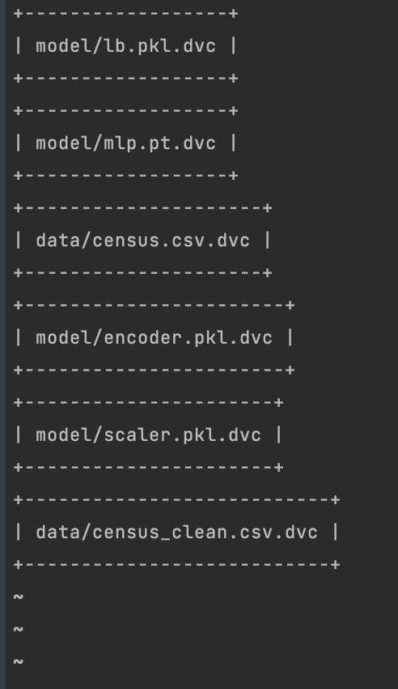
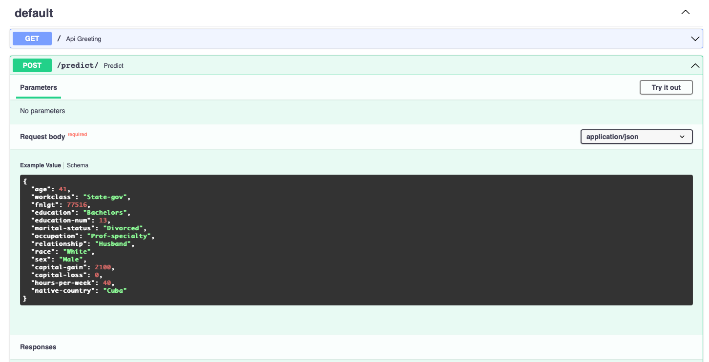

[](https://www.python.org/downloads/release/python-380/)
[](https://pytorch.org/blog/pytorch-1-dot-4-released-and-domain-libraries-updated/)
[](https://dvc.org/doc/install)
[](https://fastapi.tiangolo.com/release-notes/#0630)
[](https://pypi.org/project/uvicorn/0.17.6/)
[](https://www.heroku.com/)

# Census Income Classification
Classification model on Census Bureau data.

## Project description

The purpose of this project is to deploy a scalable pipeline as would be done in a production environment. For that 
purpose we build an API using FastAPI and deploy it using Heroku. The API run machine learning inference, a prediction 
on the Census Income Data Set. Data and models are saved on AWS s3 and we use DVC to track them.

We use a multilayer perceptron (MLP) with Dropout for the task. The model is implemented using pytorch. We use the 
pytorch version restricted to CPU in order to reduce the size of our slug (app and its dependencies). The limit of the 
slug on Heroku is of 500MB.

In the process of building this model and API we:
- check performance on slices
- write a model card
- track the models and data using DVC
- use GitHub Actions and Heroku for CI/CD

The data used for training the models and performing the analysis must be saved in 
**data/census.csv**. The data currently used come from the [Census Bureau](https://archive.ics.uci.edu/ml/datasets/census+income).

### Processing the data for training
- Raw data from the Census Bureau are in **data/census.csv**
- Raw data are pre-processed by removing white spaces and saved as **census_clean.csv**
- The raw data are split between training and testing (80%/20%)
- The data pre-processing tools are trained using only training data. The pipeline for pre-processing the data used by 
the model is as follows:

  - One hot encoding for categorical variables
  - StandardScaler for continuous variables
  - labelBinarizer for labels (target)
### Training the model
- The code related to training is found in **starter/ml/model.py**
- Hyper-parameter tuning is done using Optuna. We split training data between train and dev for that purpose (80%/20%)
The model trained use the following hyper-parameters:
  - number layers: 4
  - batch size: 1024
  - dropout rate: 0.7
  - hidden dimension: 25
  - learning rate: 0.00285

### Test results
- The overall classification performance of the trained model on test data is:
  - precision: 0.68
  - recall 0.69
  - F1: 0.68
- We also measure performance on slices of the data using the categorical feature 'education':



## Code organisation
- data used for training are found in **/data**
- Serialised trained model and preprocessing tools used in the inference pipeline are found in **/model** 
- features and hyper-parameters are in **/parameters**
- The code for processing the data, training the model and hyper-parameters search is in **/starter**
- Tests used for CI are in **starter/tests**. These tests include tests on the model, the code in general and the API
- The code for the API requests is in **main.py**
- **api_requests.py** is used to test if the API deployed works properly

## Data and Model Versioning
We use DVC to store and track both our data and models. We use AWS s3 for storage. The steps to follow for AWS and DVC 
set up are:
- In the CLI environment we install the [AWS CLI tool](https://docs.aws.amazon.com/cli/latest/userguide/cli-chap-install.html)
- To use our new S3 bucket from the AWS CLI we will need to create an IAM user with the appropriate permissions.
The full instructions can be found [here](https://docs.aws.amazon.com/IAM/latest/UserGuide/id_users_create.html#id_users_create_console).
- To save file and track it with dvc we follow steps as shown in the example below:
```bash
> dvc add model/scaler.pkl
> git add model/scaler.pkl.dvc .gitignore
> git commit -m "Initial commit of tracked scaler.pkl"
> dvc push
> git push
```
- The files tracked by DVC can be found using ```dvc dag```:



## API Creation

- We create a RESTful API using FastAPI, using type hinting and a Pydantic model to ingest the body from POST. 
This implement:
  - GET on the root giving a welcome message
  - POST that does model inference
- Unit tests to test the API
- To launch the API locally, we use the following command (the `reload` flag allows to make changes to the code and have them 
instantly deployed without restarting uvicorn):
```bash
> uvicorn main:app --reload
```
- Once deployed on Heroku, we can get the API docs at the following url: [https://geof-census-app.herokuapp.com/docs](https://geof-census-app.herokuapp.com/docs).
An example of the data structure needed for the POST request can be found in the API docs:

## CI/CD
### CI
- We set up GitHub Actions on the repository. We use the pre-made GitHub Actions python-package-conda.yml and adapt it 
to the version of python used: 3.8. This action runs ```pytest``` and ```flake8``` on push and requires both to pass without error
- We add AWS credentials to the action (secrets need to be made available to the workflow by creating Repository Secret)
Connect AWS to GitHub actions:
  - We add our [AWS credentials to the Action](https://github.com/marketplace/actions/configure-aws-credentials-action-for-github-actions).
  - We make secrets available to our workflow by creating Repository Secrets: 
  [Creating encrypted secrets for a repository](https://docs.github.com/en/actions/security-guides/encrypted-secrets#creating-encrypted-secrets-for-a-repository).
- We set up [DVC in the action](https://github.com/iterative/setup-dvc) and specify a command to ```dvc pull```, 
we need to add it in the action steps defined in the action YAML file:
```bash
 - name: Download DVC artifacts
   run: dvc pull
```

### CD with Heroku
 We use Heroku to run our python application that consists in an API for machine learning inference.
- Procfile:
  - The ```Procfile``` specifies that we use a web dyno which runs the command ```uvicorn```. This instruction allows 
  our API to be launched using ```uvicorn```
  - We use the IP ```0.0.0.0``` to tell the server to listen on every open network interface 
  - Heroku dynamically assigns the port to the ```PORT``` variable: we set the port CLI option to PORT with default 
  value 5000. Doing so we tell uvicorn which port to use
- Pulling files from DVC with Heroku: 
  - We need to give Heroku the ability to pull in data from DVC upon app start up. We will install 
    a [buildpack](https://elements.heroku.com/buildpacks/heroku/heroku-buildpack-apt) that allows the installation of 
    apt-files and then define the Aptfile that contains a path to DVC:
  - in the CLI we run:
    ```bash
    > heroku buildpacks:add --index 1 heroku-community/apt
    ```
  - Then in the root project folder we create a file called `Aptfile` that specifies the release of DVC we want 
  installed, e.g. https://github.com/iterative/dvc/releases/download/1.10.1/dvc_1.10.1_amd64.deb
  - Finally, we need to add the following code block to main.py:
  ```
  import os
  
  if "DYNO" in os.environ and os.path.isdir(".dvc"):
      os.system("dvc config core.no_scm true")
      if os.system("dvc pull") != 0:
          exit("dvc pull failed")
      os.system("rm -r .dvc .apt/usr/lib/dvc")
  ```
- Set up access to AWS on Heroku:
  ```bash
  > heroku config:set AWS_ACCESS_KEY_ID=xxx AWS_SECRET_ACCESS_KEY=yyy
  ```
- Heroku app creation:
  - We create a new app:
  ```bash
  > heroku create geof-census-app --buildpack heroku/python
  ```
  - add a remote to our local repository:
  ```bash
  > heroku git:remote -a geof-census-app
  ```
  - To be sure Heroku deploys with the proper python version we need to add a `runtime.txt` file at the root 
  of the directory
  - then we can deploy from our GitHub repository:
  ```bash
  > git push heroku main
  ```
  
## Using the API
- The get method of the app con be accessed at the following url: [https://geof-census-app.herokuapp.com/](https://geof-census-app.herokuapp.com/)
- The API can be used for prediction using the ```requests``` module. An example of how to use the API for inference can 
be found in **api_request.py**
